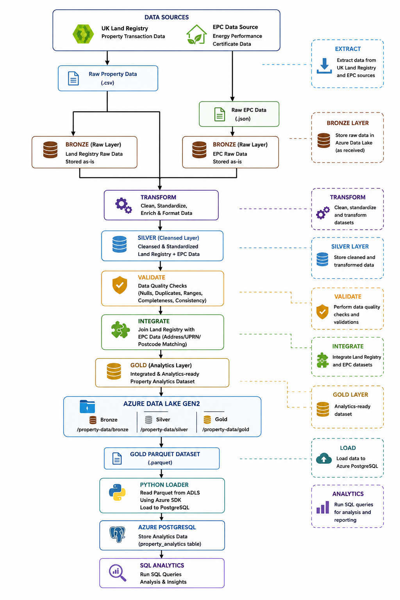

# Real Estate ELT Data Pipeline

## Project Overview

The **Real Estate ELT Data Pipeline** is an end-to-end data engineering project that extracts property transaction and energy performance data, transforms and validates the datasets, integrates them into an analytics-ready dataset, stores the data using a Bronze, Silver and Gold architecture in Azure Data Lake Storage, and loads the final Gold dataset into Azure Database for PostgreSQL.

The project combines property transaction data from the **UK Land Registry** with **Energy Performance Certificate (EPC)** data to create a property analytics dataset that can later be used for SQL analysis and Power BI dashboards.
git add .
git commit -m "docs: add architecture diagram and troubleshooting guide"
## Project Architecture



The project demonstrates a complete data engineering workflow using:

- Python
- Pandas
- Azure Data Lake Storage Gen2
- Azure Database for PostgreSQL Flexible Server
- SQLAlchemy
- PostgreSQL
- Parquet
- Azure CLI
- Git and GitHub

---

# Table of Contents

1. [Project Aim](#project-aim)
2. [Project Objectives](#project-objectives)
3. [Architecture](#architecture)
4. [Data Sources](#data-sources)
5. [Medallion Architecture](#medallion-architecture)
6. [Project Structure](#project-structure)
7. [Pipeline Workflow](#pipeline-workflow)
8. [Extract Layer](#extract-layer)
9. [Transform Layer](#transform-layer)
10. [Validation Layer](#validation-layer)
11. [Integration Layer](#integration-layer)
12. [Load Layer](#load-layer)
13. [Azure Data Lake](#azure-data-lake)
14. [Azure PostgreSQL](#azure-postgresql)
15. [Data Quality](#data-quality)
16. [SQL Analytics](#sql-analytics)
17. [Technologies Used](#technologies-used)
18. [Security](#security)
19. [Running the Project](#running-the-project)
20. [Testing and Validation](#testing-and-validation)
21. [Challenges and Solutions](#challenges-and-solutions)
22. [Future Improvements](#future-improvements)
23. [Learning Outcomes](#learning-outcomes)

---

# Project Aim

The aim of this project is to build a realistic cloud-based data engineering pipeline for UK property analytics.

The pipeline processes raw property transaction and EPC data and converts it into a clean analytics-ready dataset.

The final dataset can be queried using PostgreSQL and will be used as the data source for a future Power BI dashboard.

---

# Project Objectives

The main objectives of the project are:

- Extract property and EPC data from different sources.
- Store raw datasets in a Bronze layer.
- Clean and standardise the datasets.
- Validate data quality.
- Store transformed datasets in a Silver layer.
- Integrate Land Registry and EPC datasets.
- Produce an analytics-ready Gold dataset.
- Upload Bronze, Silver and Gold datasets to Azure Data Lake.
- Read the Gold dataset directly from Azure Data Lake.
- Load the Gold dataset into Azure PostgreSQL.
- Query the data using SQL.
- Prepare the data for Power BI reporting.
- Build a reusable and maintainable data pipeline.

---

# Architecture

The current architecture of the project is:

```text
          UK Land Registry
                 │
                 │
                 ▼
          Raw Property Data
                 │
                 │
                 ├──────────────┐
                 │              │
                 │              │
                 ▼              ▼
              Bronze        EPC Data
                 │              │
                 │              ▼
                 │           Bronze
                 │              │
                 └──────┬───────┘
                        │
                        ▼
                    Transform
                        │
                        ▼
                     Silver
                        │
                        ▼
                    Validate
                        │
                        ▼
                     Integrate
                        │
                        ▼
                       Gold
                        │
                        ▼
              Azure Data Lake Gen2
                        │
                        ▼
             Gold Parquet Dataset
                        │
                        ▼
                  Python Loader
                        │
                        ▼
              Azure PostgreSQL
                        │
                        ▼
               SQL Analytics
                        │
                        ▼
                    Power BI
                   (Next Stage)
```

---

# Data Sources

## UK Land Registry

The Land Registry dataset provides property transaction information.

The project uses fields including:

- Transaction ID
- Property price
- Transfer date
- Postcode
- Property type
- Old/New indicator
- Tenure
- Town/City
- District
- County
- Property address

---

## Energy Performance Certificate Data

The EPC dataset provides energy-related information for properties.

The processed dataset includes fields such as:

- Certificate number
- UPRN
- Postcode
- Full address
- Energy rating
- EPC registration date

The EPC data is integrated with Land Registry data using property location and address information.

---

# Medallion Architecture

The project follows a **Bronze, Silver and Gold** data architecture.

## Bronze Layer

The Bronze layer stores raw source data with minimal modification.

```text
bronze/
├── epc/
└── land_registry/
```

Example files:

```text
bronze/land_registry/
└── pp-monthly-update-new-version.csv

bronze/epc/
└── epc_energy_efficient_raw.json
```

The purpose of Bronze is to preserve the original source data.

---

## Silver Layer

The Silver layer contains cleaned and transformed data.

```text
silver/
├── epc/
│   └── epc_energy_efficient_cleaned.parquet
│
└── land_registry/
    └── land_registry_cleaned.parquet
```

Transformations include:

- Data type conversion
- Date conversion
- Price validation
- Postcode cleaning
- Property type mapping
- Tenure mapping
- Old/New mapping
- Address creation
- Missing value checks
- Duplicate checks

Parquet is used for the Silver datasets because it provides efficient columnar storage suitable for analytics workloads.

---

## Gold Layer

The Gold layer contains the final analytics-ready dataset.

```text
gold/
└── property_analytics/
    └── property_analytics_gold.parquet
```

The current Gold dataset contains:

```text
90,287 rows
17 columns
```

The Gold dataset combines cleaned property transaction data with available EPC information.

---

# Project Structure

```text
ELT pipeline for Realstate/
│
├── data/
│   │
│   ├── bronze/
│   │   ├── epc/
│   │   └── land_registry/
│   │
│   ├── silver/
│   │   ├── epc/
│   │   └── land_registry/
│   │
│   └── gold/
│       └── property_analytics/
│
├── src/
│   │
│   ├── extract/
│   │   └── read_epc.py
│   │
│   ├── transform/
│   │   ├── transform_epc.py
│   │   └── transform_land_registry.py
│   │
│   ├── validate/
│   │   └── validate_epc_silver.py
│   │
│   ├── integrate/
│   │   └── join_land_registry_epc.py
│   │
│   ├── load/
│   │   ├── upload_to_azure.py
│   │   └── load_to_postgres.py
│   │
│   └── run_pipeline.py
│
├── sql/
│   └── analytics_queries.sql
│
├── logs/
│   └── pipeline.log
│
├── .env
├── .gitignore
├── requirements.txt
└── README.md
```

The `.env` file and virtual environment are excluded from Git.

---

# Pipeline Workflow

The end-to-end pipeline follows these stages:

```text
Extract
   ↓
Transform
   ↓
Validate
   ↓
Integrate
   ↓
Create Gold
   ↓
Upload to Azure Data Lake
   ↓
Read Gold from Azure Data Lake
   ↓
Load into PostgreSQL
   ↓
SQL Analytics
   ↓
Power BI
```

---

# Extract Layer

The extraction layer retrieves the source data required by the pipeline.

The extraction code is stored under:

```text
src/extract/
```

EPC data is extracted and saved into the Bronze layer before transformation.

Keeping extraction separate from transformation makes the pipeline easier to maintain and debug.

---

# Transform Layer

Transformation scripts are stored under:

```text
src/transform/
```

The Land Registry transformation performs several data-cleaning operations.

For example, the raw property-type codes are converted into meaningful categories:

```text
D → Detached
S → Semi-Detached
T → Terraced
F → Flats/Maisonettes
O → Other
```

The Old/New indicator is transformed into:

```text
N → Existing
Y → New
```

Tenure is transformed into:

```text
F → Freehold
L → Leasehold
```

The transformation also standardises dates, postcodes and property addresses.

---

# Validation Layer

Data validation is an important part of the pipeline.

The project checks:

- Invalid dates
- Missing prices
- Invalid prices
- Missing postcodes
- Duplicate transaction IDs
- Required columns
- Dataset structure
- Data types

During Land Registry validation, the pipeline identified:

```text
Total records:       90,287
Postcodes available: 89,991
Missing postcodes:      296
Duplicate IDs:            0
```

This allows data-quality problems to be identified before the data reaches the Gold layer.

---

# Integration Layer

The integration layer combines Land Registry and EPC data.

The integration script is:

```text
src/integrate/join_land_registry_epc.py
```

Property matching uses:

- Postcode
- Normalised property address

An `address_key` is generated to improve matching between the two sources.

For example:

```text
3, Jupiter Heights, UXBRIDGE, UB10 0TA
```

is normalised before being compared with the corresponding address in the other dataset.

The integration produces the final Gold analytics dataset.

---

# Gold Analytics Dataset

The Gold dataset contains 17 analytics fields:

```text
transaction_id
price
transfer_date
postcode
town_city
district
county
property_type
old_new
tenure
full_address
certificate_number
uprn
energy_rating
epc_registration_date
sale_year
sale_month
```

The dataset currently contains:

```text
90,287 rows × 17 columns
```

---

# Load Layer

The project has two main load operations.

## Upload to Azure Data Lake

The following script:

```text
src/load/upload_to_azure.py
```

uploads the project datasets to Azure Data Lake Storage.

The cloud structure is:

```text
property-data/
│
├── bronze/
│   ├── epc/
│   └── land_registry/
│
├── silver/
│   ├── epc/
│   └── land_registry/
│
└── gold/
    └── property_analytics/
        └── property_analytics_gold.parquet
```

---

## Load Azure Data Lake to PostgreSQL

The following script:

```text
src/load/load_to_postgres.py
```

downloads the Gold Parquet dataset directly from Azure Data Lake.

The flow is:

```text
Azure Data Lake
       ↓
Gold Parquet
       ↓
Azure SDK
       ↓
Binary data
       ↓
io.BytesIO
       ↓
Pandas DataFrame
       ↓
SQLAlchemy
       ↓
psycopg2
       ↓
Azure PostgreSQL
```

This means PostgreSQL is no longer loaded directly from the local Gold file.

The cloud data flow is now:

```text
Azure Data Lake
      ↓
Azure PostgreSQL
```

---

# Azure Data Lake

The project uses **Azure Data Lake Storage Gen2** as the cloud data lake.

Storage account:

```text
stpropertyetlnadia01
```

File system/container:

```text
property-data
```

The data lake contains Bronze, Silver and Gold layers.

Authentication from Python uses:

```python
DefaultAzureCredential()
```

This avoids storing Azure access keys directly in Python source code.

---

# Azure PostgreSQL

The analytics database uses **Azure Database for PostgreSQL Flexible Server**.

Database:

```text
property_analytics
```

Table:

```text
property_analytics
```

The Gold dataset is loaded using:

```python
gold_df.to_sql(
    name="property_analytics",
    con=engine,
    if_exists="replace",
    index=False,
    chunksize=1000,
)
```

The data is loaded in batches of 1,000 records.

SSL is required for the PostgreSQL connection.

---

# PostgreSQL Validation

After loading the dataset, the database was validated using SQL.

## Row Count

```sql
SELECT COUNT(*)
FROM property_analytics;
```

Result:

```text
90,287
```

---

## Column Completeness

```sql
SELECT
    COUNT(*) AS total_rows,
    COUNT(property_type) AS property_type_count,
    COUNT(old_new) AS old_new_count,
    COUNT(tenure) AS tenure_count,
    COUNT(energy_rating) AS energy_rating_count
FROM property_analytics;
```

Current result:

```text
total_rows             90287
property_type_count     90287
old_new_count           90287
tenure_count            90287
energy_rating_count         8
```

Property type, Old/New and tenure therefore have complete coverage in the Gold dataset.

EPC coverage is currently limited because the current EPC extraction contains only a small set of matched properties.

---

# SQL Analytics

SQL queries are stored in:

```text
sql/analytics_queries.sql
```

These queries are used for both data engineering validation and business analysis.

## Total Transactions

```sql
SELECT COUNT(*) AS total_transactions
FROM property_analytics;
```

---

## Duplicate Transaction Check

```sql
SELECT
    COUNT(*) AS total_rows,
    COUNT(DISTINCT transaction_id) AS unique_transactions
FROM property_analytics;
```

---

## Property Type Analysis

```sql
SELECT
    property_type,
    COUNT(*) AS total_sales
FROM property_analytics
GROUP BY property_type
ORDER BY total_sales DESC;
```

---

## Average Price by Property Type

```sql
SELECT
    property_type,
    ROUND(AVG(price), 2) AS average_price
FROM property_analytics
GROUP BY property_type
ORDER BY average_price DESC;
```

---

## New vs Existing Properties

```sql
SELECT
    old_new,
    COUNT(*) AS total_sales,
    ROUND(AVG(price), 2) AS average_price
FROM property_analytics
GROUP BY old_new;
```

---

## Freehold vs Leasehold

```sql
SELECT
    tenure,
    COUNT(*) AS total_sales,
    ROUND(AVG(price), 2) AS average_price
FROM property_analytics
GROUP BY tenure;
```

---

## Sales by Location

```sql
SELECT
    town_city,
    COUNT(*) AS total_sales,
    ROUND(AVG(price), 2) AS average_price
FROM property_analytics
GROUP BY town_city
ORDER BY total_sales DESC;
```

---

# Technologies Used

## Programming

- Python
- SQL

## Python Libraries

- Pandas
- PyArrow
- Requests
- python-dotenv
- SQLAlchemy
- psycopg2
- azure-identity
- azure-storage-file-datalake

## Cloud

- Microsoft Azure
- Azure Data Lake Storage Gen2
- Azure Database for PostgreSQL Flexible Server
- Azure CLI

## Data Formats

- CSV
- JSON
- Parquet

## Database

- PostgreSQL

## Development Tools

- Visual Studio Code
- Mac Terminal
- Git
- GitHub
- Python Virtual Environment

---

# Security

Sensitive configuration is stored in:

```text
.env
```

Example structure:

```text
AZURE_STORAGE_ACCOUNT=...
AZURE_FILE_SYSTEM=...

POSTGRES_HOST=...
POSTGRES_DATABASE=...
POSTGRES_USER=...
POSTGRES_PASSWORD=...
POSTGRES_PORT=5432
```

The actual `.env` file is not committed to GitHub.

The `.gitignore` contains:

```text
.env
.venv/
```

Azure authentication uses `DefaultAzureCredential`, and PostgreSQL connections require SSL.

Passwords and credentials are therefore kept outside the Python source files.

---

# Python Virtual Environment

The project uses a Python virtual environment.

Create it with:

```bash
python3 -m venv .venv
```

Activate it on macOS:

```bash
source .venv/bin/activate
```

Install dependencies:

```bash
python -m pip install -r requirements.txt
```

Using a virtual environment prevents project packages from interfering with the system or Homebrew Python installation.

---

# Running the Project

Activate the environment:

```bash
source .venv/bin/activate
```

Run the complete pipeline:

```bash
python src/run_pipeline.py
```

The pipeline executes the required extraction, transformation, validation, integration and loading stages.

Individual scripts can also be run separately during development and debugging.

For example:

```bash
python src/transform/transform_land_registry.py
```

```bash
python src/integrate/join_land_registry_epc.py
```

```bash
python src/load/upload_to_azure.py
```

```bash
python src/load/load_to_postgres.py
```

---

# Connecting to PostgreSQL

The database can be accessed from the terminal using `psql`.

Example:

```bash
psql "host=<server>.postgres.database.azure.com port=5432 dbname=property_analytics user=<username> sslmode=require"
```

The password is entered securely when prompted.

After connecting:

```text
property_analytics=>
```

SQL queries can be executed directly.

For example:

```sql
SELECT COUNT(*)
FROM property_analytics;
```

---

# Testing and Validation

Testing has been performed throughout the pipeline rather than only after loading.

## Transformation Testing

The Land Registry transformation confirmed:

```text
Transfer dates successfully converted
Invalid transfer dates: 0

Missing price values: 0
Invalid price values: 0

Duplicate transaction IDs: 0
```

Property-type distribution after transformation:

```text
Semi-Detached        24,236
Terraced             23,684
Detached             20,412
Flats/Maisonettes    15,992
Other                 5,963
```

Old/New distribution:

```text
Existing    83,045
New          7,242
```

Tenure distribution:

```text
Freehold     68,730
Leasehold    21,557
```

Postcode availability:

```text
Available    89,991
Missing         296
```

---

# Challenges and Solutions

## Python Environment Conflict

### Problem

After installing Homebrew, the system Python environment did not contain Pandas.

Attempting to install packages directly also produced a PEP 668 externally-managed-environment warning.

### Solution

A project-specific virtual environment was created:

```bash
python3 -m venv .venv
source .venv/bin/activate
```

Dependencies were then installed inside the virtual environment.

---

## PostgreSQL Connection String

### Problem

The initial PostgreSQL connection failed because special characters in the password could interfere with a manually constructed database URL.

### Solution

SQLAlchemy's `URL.create()` was used:

```python
database_url = URL.create(
    drivername="postgresql+psycopg2",
    username=postgres_user,
    password=postgres_password,
    host=postgres_host,
    port=int(postgres_port),
    database=postgres_database,
)
```

This provides safer handling of connection parameters.

---

## Missing Property Categories

### Problem

Initial PostgreSQL validation showed:

```text
property_type_count = 0
old_new_count = 0
tenure_count = 0
```

### Investigation

The issue was traced back to the transformation stage rather than PostgreSQL.

### Solution

The Land Registry Silver transformation was rerun and validated.

After rebuilding Silver → Gold → ADLS → PostgreSQL, the result became:

```text
property_type_count = 90287
old_new_count       = 90287
tenure_count        = 90287
```

This demonstrates why data validation at each pipeline stage is important.

---

## Limited EPC Matches

The current Gold dataset contains only a small number of EPC matches.

Current PostgreSQL validation shows:

```text
energy_rating_count = 8
```

This is because the current EPC extraction covers only a limited sample of properties.

Expanding EPC extraction is therefore an important future improvement.

---

# Future Improvements

The project can be extended with:

- Expand EPC extraction to improve property matching.
- Add more automated data-quality tests.
- Add exception handling and retry logic.
- Add incremental loading instead of replacing the complete PostgreSQL table.
- Add database indexes.
- Introduce staging tables.
- Add PostgreSQL views for reporting.
- Add advanced SQL queries using CTEs and window functions.
- Add pipeline scheduling.
- Use Azure Data Factory or Apache Airflow for orchestration.
- Add Azure Key Vault for secrets management.
- Add CI/CD using GitHub Actions or Azure DevOps.
- Add monitoring and alerting.
- Add unit tests with Pytest.
- Build a Power BI analytics dashboard.
- Add infrastructure-as-code using Terraform.

---

# Planned Power BI Dashboard

The next stage of the project is Power BI.

The planned dashboard will contain several analytical areas.

## Executive Overview

- Total property sales
- Average sale price
- Median sale price
- Total transaction value
- Sales trends

## Property Analysis

- Sales by property type
- Average price by property type
- New vs Existing properties
- Freehold vs Leasehold

## Location Analysis

- County
- District
- Town/City
- Postcode
- Property price by location

## EPC Analysis

- Energy-rating distribution
- Property price by energy rating
- EPC coverage

---

# Learning Outcomes

This project has provided practical experience with:

- Building an end-to-end data engineering pipeline
- Python data processing
- Pandas
- CSV and JSON processing
- Parquet
- Data cleaning
- Data validation
- Dataset integration
- Property/address matching
- Bronze/Silver/Gold architecture
- Azure Data Lake Storage Gen2
- Azure authentication
- Azure CLI
- Azure PostgreSQL Flexible Server
- PostgreSQL
- SQLAlchemy
- psycopg2
- SQL data validation
- SQL analytics
- Environment variables
- Python virtual environments
- Git and GitHub
- Debugging data pipelines
- Cloud-to-database data movement

---

# Current Project Status

The project currently supports the following end-to-end flow:

```text
Source Data
    ↓
Extract
    ↓
Bronze
    ↓
Transform
    ↓
Silver
    ↓
Validate
    ↓
Integrate
    ↓
Gold
    ↓
Azure Data Lake
    ↓
Azure PostgreSQL
    ↓
SQL Analytics
```

The next development stage is:

```text
Azure PostgreSQL
       ↓
Power BI
       ↓
Interactive Property Analytics Dashboard
```

---
# Troubleshooting, Challenges and Solutions

During development of the Real Estate ELT Data Pipeline, several issues were
identified across Python, Azure Data Lake, PostgreSQL, data transformation,
authentication and SQL validation.

Documenting these issues demonstrates the debugging and problem-solving process
used while developing the pipeline.

---

## 1. Python Could Not Find Pandas

### Problem

When running the Land Registry transformation:

```bash
python3 src/transform/transform_land_registry.py
```

Python returned:

```text
ModuleNotFoundError: No module named 'pandas'
```

### Cause

The `python3` command was using a Python installation that did not contain
the project dependencies.

Different Python installations were available on the Mac, which meant packages
installed for one Python installation were not necessarily available to another.

### Investigation

The active Python installation was checked using:

```bash
which python3
```

and:

```bash
python3 --version
```

### Solution

Instead of installing packages globally, a dedicated Python virtual environment
was created for the project.

```bash
python3 -m venv .venv
```

The environment was activated with:

```bash
source .venv/bin/activate
```

The active Python was verified using:

```bash
which python
```

The result pointed to:

```text
.../ELT pipeline for Realstate/.venv/bin/python
```

The project dependencies were then installed inside the virtual environment.

### Lesson Learned

Data engineering projects should use isolated Python environments so that
dependencies remain consistent and reproducible.

---

## 2. PEP 668 / Homebrew Python Installation Error

### Problem

Attempting to install Pandas directly using pip produced an
`externally-managed-environment` warning related to PEP 668.

The message suggested using:

```text
--break-system-packages
```

### Cause

The Python installation was managed by Homebrew.

Modern Homebrew Python installations protect the system-managed Python
environment from direct package installation.

### Solution

The system Python environment was not modified.

Instead, the project virtual environment was used:

```bash
python3 -m venv .venv
source .venv/bin/activate
```

Packages could then safely be installed inside `.venv`.

### Lesson Learned

Avoid modifying a package-manager-controlled Python installation.

A virtual environment provides a safer and cleaner solution.

---

## 3. Protecting the Virtual Environment and Secrets from Git

### Problem

The project now contained:

```text
.venv/
.env
```

Neither should be committed to GitHub.

The `.venv` directory contains locally installed Python packages, while `.env`
contains database and cloud configuration.

### Solution

Both were added to `.gitignore`:

```gitignore
.env
.venv/
```

### Lesson Learned

Local environments and secrets should never be stored in source control.

---

## 4. PostgreSQL Connection Interpreted as a Local Socket

### Problem

The first attempt to load the Gold dataset into PostgreSQL failed with an error
similar to:

```text
psycopg2.OperationalError:
connection to server on socket
"@psql-property-etl-nadia01.postgres.database.azure.com/.s.PGSQL.5432"
failed
```

### Cause

The PostgreSQL connection URL was originally manually constructed:

```python
database_url = (
    f"postgresql+psycopg2://"
    f"{postgres_user}:{postgres_password}"
    f"@{postgres_host}:{postgres_port}/"
    f"{postgres_database}"
)
```

Special characters in database credentials can have special meaning inside a URL.

This can cause SQLAlchemy or psycopg2 to interpret parts of the connection
information incorrectly.

### Solution

The connection was changed to SQLAlchemy's structured `URL.create()` method:

```python
from sqlalchemy.engine import URL

database_url = URL.create(
    drivername="postgresql+psycopg2",
    username=postgres_user,
    password=postgres_password,
    host=postgres_host,
    port=int(postgres_port),
    database=postgres_database,
)
```

### Lesson Learned

Database connection parameters should not be manually concatenated when a
library provides a structured connection builder.

`URL.create()` safely handles connection values and avoids URL parsing problems.

---

## 5. PostgreSQL Password Authentication Failed

### Problem

When connecting manually using `psql`, the first connection attempt returned:

```text
FATAL: password authentication failed for user "propertyadmin"
```

### Cause

The password entered at the PostgreSQL prompt did not match the password
configured for the Azure PostgreSQL administrator.

### Solution

The connection command was run again:

```bash
psql "host=<postgres-server>.postgres.database.azure.com \
port=5432 \
dbname=property_analytics \
user=propertyadmin \
sslmode=require"
```

The correct password was entered when prompted.

The connection then succeeded and displayed:

```text
SSL connection
Type "help" for help.

property_analytics=>
```

### Lesson Learned

Authentication errors should be separated from network and application errors.

Successfully reaching the server but receiving:

```text
password authentication failed
```

indicates that the PostgreSQL server is reachable and the problem is with
authentication rather than connectivity.

---

## 6. `psql` Command Was Not Installed

### Problem

When attempting to connect to PostgreSQL from the Mac terminal:

```bash
psql "host=..."
```

the terminal returned:

```text
bash: psql: command not found
```

### Cause

The PostgreSQL command-line client was not installed or was not available
through the terminal PATH.

### Solution

The PostgreSQL client was installed/configured on the Mac.

After installation, running:

```bash
psql --version
```

confirmed that the client was available.

The project could then connect successfully to Azure PostgreSQL.

### Lesson Learned

A database server and a database client are separate components.

Azure hosts the PostgreSQL server, but a local client such as `psql` is still
required when querying it directly from the terminal.

---

## 7. Running Python Commands Inside PostgreSQL

### Problem

After connecting to PostgreSQL, a Python command was entered at:

```text
property_analytics=>
```

For example:

```text
python3 src/transform/transform_land_registry.py
```

The PostgreSQL prompt then changed to:

```text
property_analytics->
```

### Cause

`psql` only accepts SQL statements and PostgreSQL commands.

Python scripts must be executed from the operating-system terminal.

The continuation prompt:

```text
property_analytics->
```

means PostgreSQL believes an SQL statement has been started but not completed.

### Solution

The unfinished command was cancelled with:

```text
Ctrl + C
```

PostgreSQL was exited using:

```text
\q
```

The Python script was then executed from the normal terminal:

```bash
python src/transform/transform_land_registry.py
```

### Lesson Learned

The two command environments must be distinguished:

```text
Mac terminal
    ↓
Python / Git / Azure CLI commands

PostgreSQL psql prompt
    ↓
SQL commands
```

---

## 8. PostgreSQL SQL Syntax Error Caused by an Unfinished Query

### Problem

The following query was entered without a semicolon:

```sql
SELECT COUNT(*) FROM property_analytics
```

The prompt changed from:

```text
property_analytics=>
```

to:

```text
property_analytics->
```

A second `SELECT` statement was then entered, resulting in:

```text
ERROR: syntax error at or near "SELECT"
```

### Cause

PostgreSQL was waiting for the first SQL statement to finish.

The second `SELECT` therefore became part of the unfinished first statement.

### Solution

SQL statements were terminated correctly with:

```sql
SELECT COUNT(*)
FROM property_analytics;
```

### Lesson Learned

SQL commands entered in `psql` should normally end with a semicolon:

```text
;
```

The prompt is also useful for debugging:

```text
property_analytics=>   Ready for a new command

property_analytics->   Waiting for the current command to finish
```

---

## 9. PostgreSQL Output Displayed `(END)`

### Problem

Large SQL query results displayed:

```text
(END)
```

and appeared to prevent further typing.

### Cause

`psql` automatically uses a pager for output that does not fit on one terminal
screen.

The user was viewing the query output rather than being stuck in PostgreSQL.

### Solution

Press:

```text
q
```

to exit the pager and return to:

```text
property_analytics=>
```

### Lesson Learned

`(END)` is not an application error. It indicates that the PostgreSQL output is
being displayed through the terminal pager.

---

## 10. Property Type, Old/New and Tenure Were Empty

### Problem

After the initial Gold dataset was loaded into PostgreSQL, this validation query
was executed:

```sql
SELECT
    COUNT(*) AS total_rows,
    COUNT(property_type) AS property_type_count,
    COUNT(old_new) AS old_new_count,
    COUNT(tenure) AS tenure_count,
    COUNT(energy_rating) AS energy_rating_count
FROM property_analytics;
```

The initial result showed:

```text
total_rows             90287
property_type_count         0
old_new_count               0
tenure_count                0
```

### Investigation

Because the PostgreSQL table contained all 90,287 rows, the database load itself
was working.

The issue therefore had to be investigated further upstream.

The Land Registry Silver transformation was rerun:

```bash
python src/transform/transform_land_registry.py
```

The transformed values showed:

```text
Property types:

Semi-Detached        24236
Terraced             23684
Detached             20412
Flats/Maisonettes    15992
Other                 5963
```

Old/New values showed:

```text
Existing    83045
New          7242
```

Tenure showed:

```text
Freehold     68730
Leasehold    21557
```

This confirmed that the corrected Silver dataset contained the expected values.

### Solution

The downstream pipeline was rebuilt:

```text
Transform Land Registry
        ↓
Silver
        ↓
Integrate
        ↓
Gold
        ↓
Upload to ADLS
        ↓
Load to PostgreSQL
```

The following scripts were rerun:

```bash
python src/integrate/join_land_registry_epc.py
python src/load/upload_to_azure.py
python src/load/load_to_postgres.py
```

The PostgreSQL validation was then repeated.

The corrected result became:

```text
total_rows             90287
property_type_count     90287
old_new_count           90287
tenure_count            90287
energy_rating_count         8
```

### Lesson Learned

A successful database load does not guarantee that the source data is correct.

Data should be validated at every stage:

```text
Bronze
  ↓
Silver validation
  ↓
Gold validation
  ↓
Database validation
```

---

## 11. Missing Postcodes in Land Registry Data

### Problem

Land Registry validation identified missing postcode values.

Results:

```text
Total rows:          90,287
Has postcode:        89,991
Missing postcode:       296
```

### Investigation

The missing postcode rows were inspected separately.

A postcode availability flag was also produced:

```text
True     89991
False      296
```

### Decision

The missing records were not treated as a pipeline failure.

They were identified and documented as a data-quality issue.

### Lesson Learned

Not every missing value should automatically cause a record to be deleted.

A data engineer should first understand:

- whether the field is required,
- whether the record is still useful,
- how much data is affected,
- and whether downstream processing depends on the field.

---

## 12. Limited EPC Matching

### Problem

PostgreSQL validation showed:

```text
energy_rating_count = 8
```

despite the Gold dataset containing:

```text
90,287 rows
```

### Investigation

The Gold integration was checked and eight property-level EPC matches were found.

Matching was performed using:

```text
postcode
+
normalised address
```

### Cause

The current EPC extraction contains only a limited sample of EPC records.

Therefore, only a small number of Land Registry properties can currently be
matched with EPC information.

### Current Decision

The Gold dataset retains all Land Registry transactions.

Where no EPC record is available, EPC fields remain null.

### Future Improvement

Expand the EPC extraction so that significantly more property records can be
matched.

### Lesson Learned

A low match rate does not necessarily mean the join logic is broken.

Coverage of both source datasets must be considered when evaluating integration
results.

---

## 13. Environment Variable Name Was Case-Sensitive

### Problem

While changing the PostgreSQL loader to read Gold data directly from Azure Data
Lake, the Azure Storage environment variable was initially written as:

```python
os.getenv("AZURE_STORAGE_Account")
```

The `.env` file contained:

```text
AZURE_STORAGE_ACCOUNT=...
```

### Cause

Environment variable names are case-sensitive.

These are different:

```text
AZURE_STORAGE_Account
AZURE_STORAGE_ACCOUNT
```

### Solution

The Python code was corrected to:

```python
storage_account_name = os.getenv(
    "AZURE_STORAGE_ACCOUNT"
)
```

Validation was also added:

```python
if not storage_account_name:
    raise ValueError(
        "AZURE_STORAGE_ACCOUNT was not found in .env"
    )
```

### Lesson Learned

Configuration should be validated immediately when the application starts.

This provides a clear error instead of allowing an incorrect configuration to
fail later in the pipeline.

---

## 14. PostgreSQL Was Initially Loaded from the Local Gold File

### Problem

The first version of `load_to_postgres.py` used:

```python
gold_df = pd.read_parquet(
    "data/gold/property_analytics/"
    "property_analytics_gold.parquet"
)
```

This meant the architecture was actually:

```text
Local Gold
   ├──→ Azure Data Lake
   └──→ Azure PostgreSQL
```

rather than:

```text
Azure Data Lake
      ↓
Azure PostgreSQL
```

### Improvement

The loader was redesigned to download the Gold Parquet file directly from Azure
Data Lake.

The Gold file is retrieved using:

```python
file_client = file_system_client.get_file_client(
    azure_gold_file
)

download = file_client.download_file()

gold_file_bytes = download.readall()
```

The downloaded bytes are converted into a Pandas DataFrame:

```python
gold_df = pd.read_parquet(
    io.BytesIO(gold_file_bytes)
)
```

The DataFrame is then loaded into PostgreSQL.

### Validation

Running:

```bash
python src/load/load_to_postgres.py
```

produced:

```text
Gold dataset downloaded from Azure Data Lake.
Gold dataset shape: (90287, 17)

Gold dataset loaded into PostgreSQL successfully.
Table name: property_analytics
```

### Lesson Learned

Architecture diagrams should represent the actual movement of data.

Changing the loader created a genuine:

```text
Azure Data Lake
      ↓
Gold Parquet
      ↓
Python Loader
      ↓
Azure PostgreSQL
```

cloud data flow.

---

## 15. Azure Authentication Without Storage Keys

### Requirement

The pipeline needed to access Azure Data Lake without placing Azure Storage keys
directly inside the Python source code.

### Solution

Azure Identity was used:

```python
from azure.identity import DefaultAzureCredential

credential = DefaultAzureCredential()
```

The Data Lake client then uses the credential:

```python
service_client = DataLakeServiceClient(
    account_url=account_url,
    credential=credential,
)
```

For local development, the authenticated Azure CLI identity can be used.

### Lesson Learned

Cloud credentials should not be hard-coded into application source code.

Identity-based authentication provides a cleaner and safer approach.

---

## 16. PostgreSQL SSL Connection

### Requirement

Azure PostgreSQL requires a secure database connection.

### Solution

SSL was explicitly required in SQLAlchemy:

```python
engine = create_engine(
    database_url,
    connect_args={
        "sslmode": "require"
    },
)
```

The connection was also independently verified using `psql`.

The terminal confirmed an encrypted connection using TLS.

### Lesson Learned

Database connectivity testing should confirm both successful authentication and
transport security.

---

# Troubleshooting Summary

The main issues encountered during development were:

| Issue | Root Cause | Solution |
|---|---|---|
| `No module named pandas` | Wrong/unconfigured Python environment | Created `.venv` |
| PEP 668 warning | Homebrew-managed Python | Installed packages inside virtual environment |
| PostgreSQL socket error | Connection URL parsing | Used `URL.create()` |
| Password authentication failed | Incorrect password entered | Retried with correct PostgreSQL password |
| `psql: command not found` | PostgreSQL client unavailable | Installed/configured PostgreSQL client |
| SQL syntax error | Previous query missing `;` | Properly terminated SQL statements |
| Python entered in `psql` | Wrong command environment | Exited `psql` and ran Python from terminal |
| `(END)` displayed | PostgreSQL pager | Pressed `q` |
| Property fields all null | Upstream transformation needed rebuilding | Rebuilt Silver → Gold → ADLS → PostgreSQL |
| 296 missing postcodes | Source data quality | Identified and documented missing records |
| Only 8 EPC matches | Limited EPC source coverage | Keep null EPC values and expand extraction later |
| Azure env variable missing | Incorrect variable capitalisation | Corrected `AZURE_STORAGE_ACCOUNT` |
| PostgreSQL reading local Gold | Initial architecture design | Changed loader to read Gold directly from ADLS |

---

# Data Engineering Lessons from Troubleshooting

The troubleshooting process highlighted several important data engineering
principles:

1. **Validate every layer** rather than only checking the final database.
2. **Separate configuration from source code** using environment variables.
3. **Use isolated Python environments** for reproducible dependencies.
4. **Never assume a successful load means the data is correct.**
5. **Investigate problems upstream** when database values are unexpected.
6. **Measure data quality** instead of silently removing problematic records.
7. **Use secure cloud authentication** instead of hard-coded credentials.
8. **Validate cloud-to-database data movement independently.**
9. **Document known limitations**, such as limited EPC coverage.
10. **Design the architecture to reflect the real data flow.**

# Conclusion

The Real Estate ELT Data Pipeline demonstrates how raw data from multiple sources can be transformed into a structured analytics platform.

The project moves beyond local data processing by using Azure Data Lake Storage for cloud-based data storage and Azure PostgreSQL as the analytics database.

The final Gold dataset contains more than 90,000 property transaction records and can be queried using SQL.

The next stage will extend the project into business intelligence by connecting Azure PostgreSQL to Power BI and developing interactive property analytics dashboards.